# Desktop client

## Description

This is a desktop client that can completely replace the web application used for connecting to microservices. It is built using Swing UI in Java, along with several libraries such as FlatLaf, IntelliJ Themes, and MigLayout. The application uses the Spring framework to leverage core functionalities like dependency injection, configuration, and a web client, without starting a web server or using a port. The application supports various color schemes, as well as both dark and light theme options.

### Preview

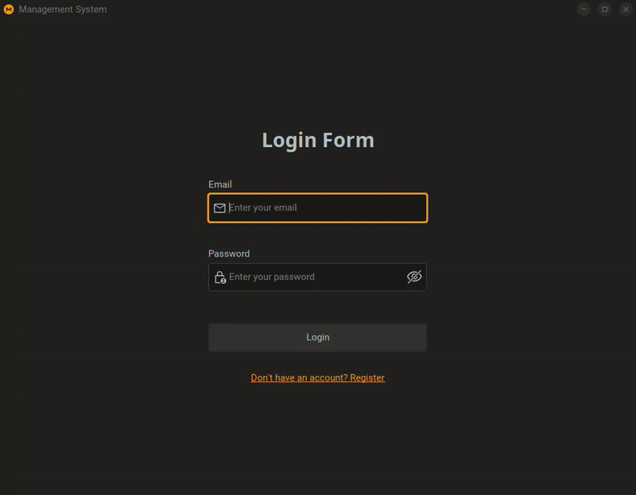

### Software

**Tools/libraries:** Java (Swing UI), Spring, Flatlaf (Themes for Swing components), MigLayout (New layout manager for Swing), Lombok, Assertj, Maven

### Default Configuration

- **Default app.theme-variant:** `dark`
- **Default app.theme-name:** `material`
- **Default flat.inspector.enabled:** `true`
    - Use `Ctrl` + `Alt` + `Shift` + `X` to activete/decativate inspect mode when the app is running

### Supported themes

**Theme variants:**

- `light`
- `dark`

**Theme names:** `Flat`, `macOS`, `IntelliJ`, `Cyan-Purple`, `Material`, `Solarized-Carbon`, `Orange-Ocean`

Theme variants and names are not case-sensitive!

### Useful guides

- [Flatlaf docs](https://www.formdev.com/flatlaf/)
- [Flatlaf source](https://github.com/JFormDesigner/FlatLaf)
- [Flatlaf IntelliJ themes](https://github.com/JFormDesigner/FlatLaf/tree/main/flatlaf-intellij-themes)
- [JFormDesigner](https://github.com/JFormDesigner/FlatLaf#demo)
- [MigLayout](http://www.miglayout.com/)

### Start the application


```bash
mvn spring-boot:run
```


## Gallery

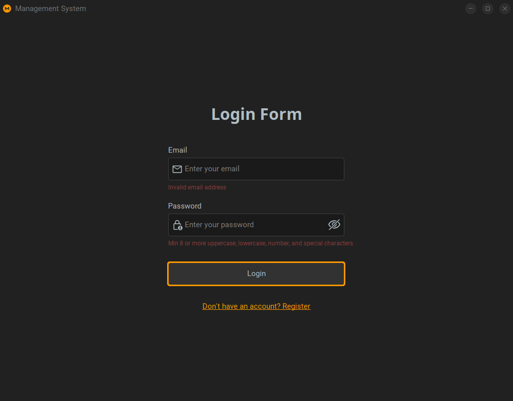
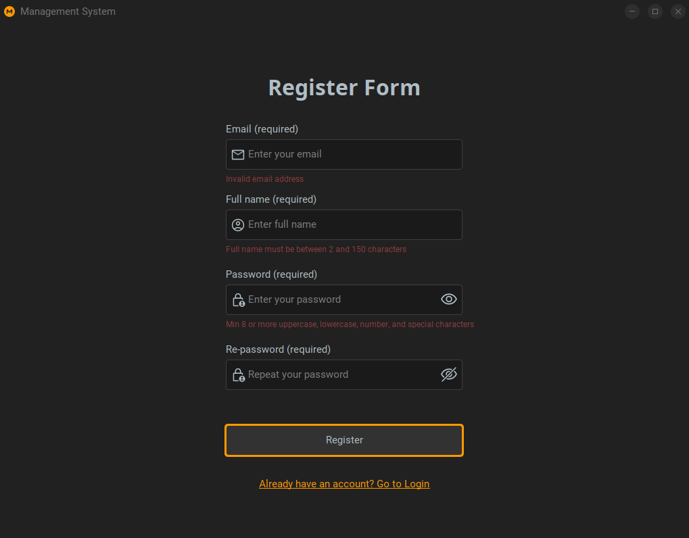

**Themes**

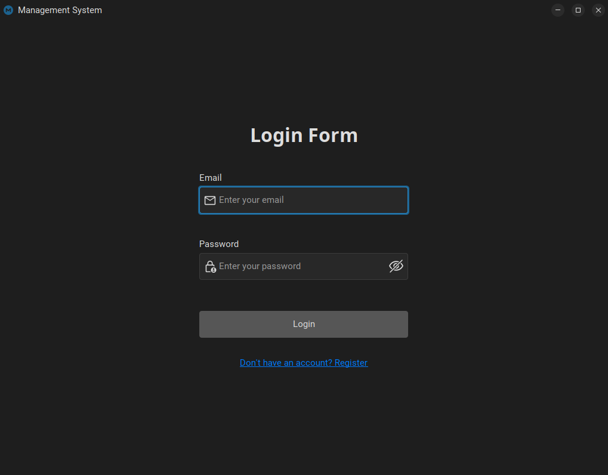
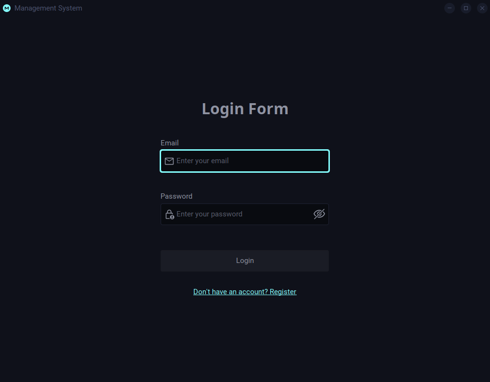
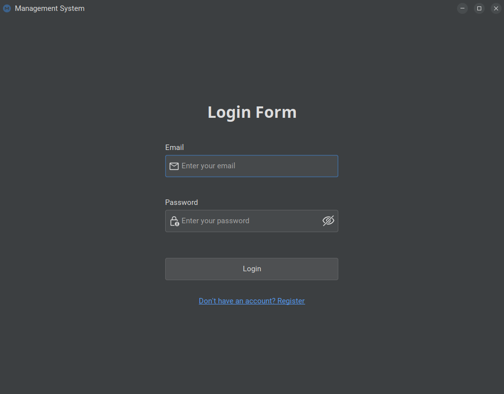
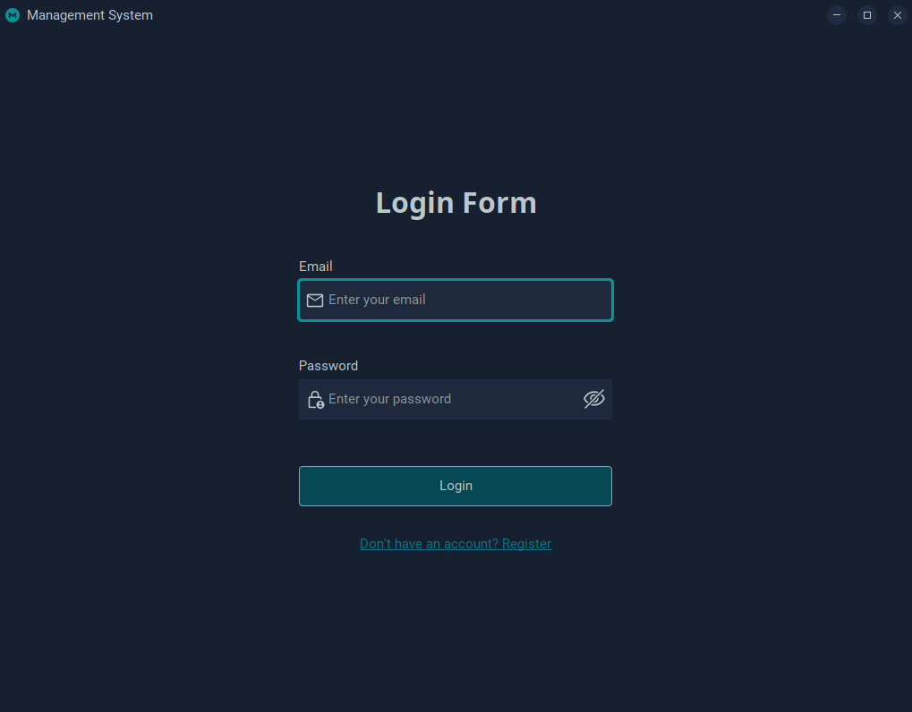
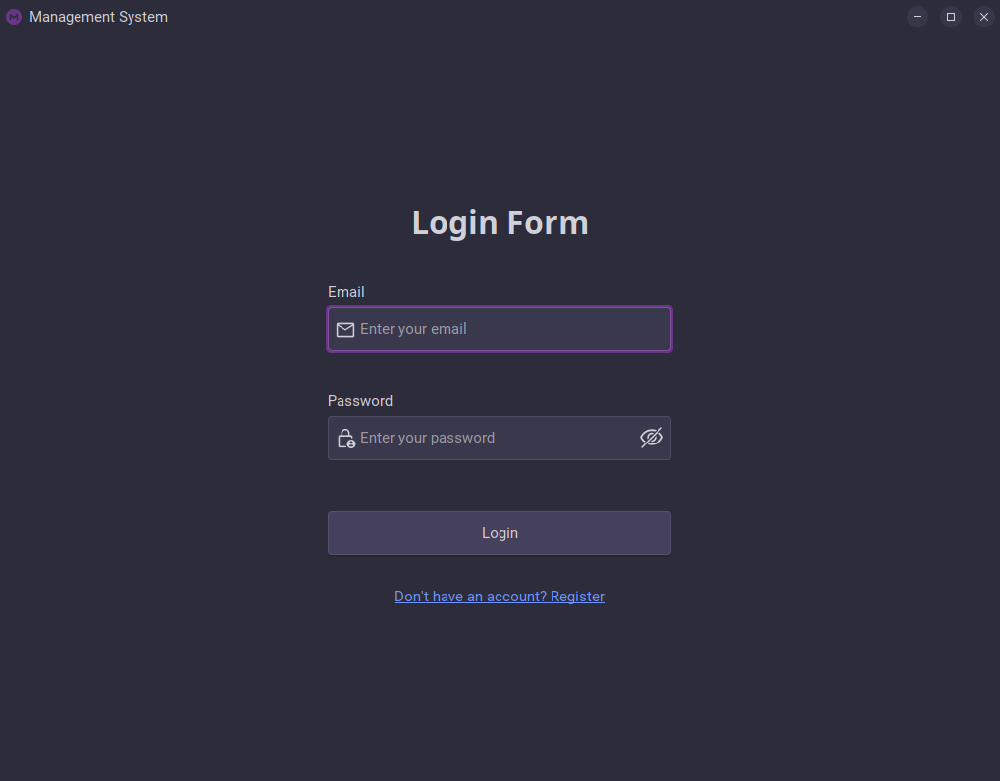
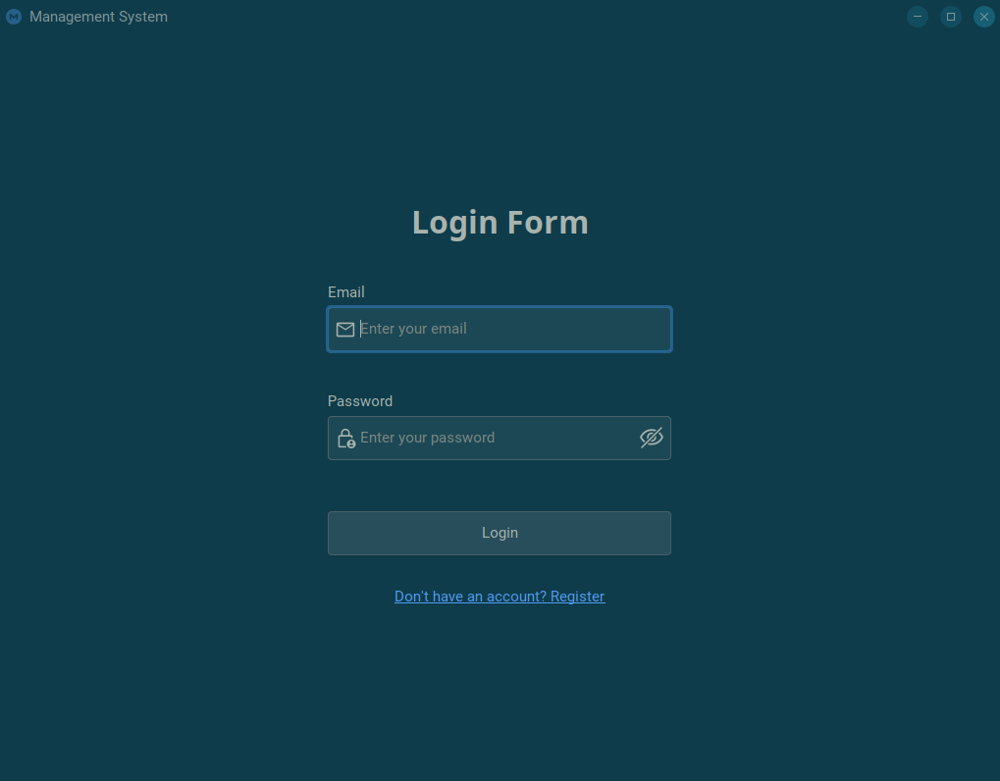
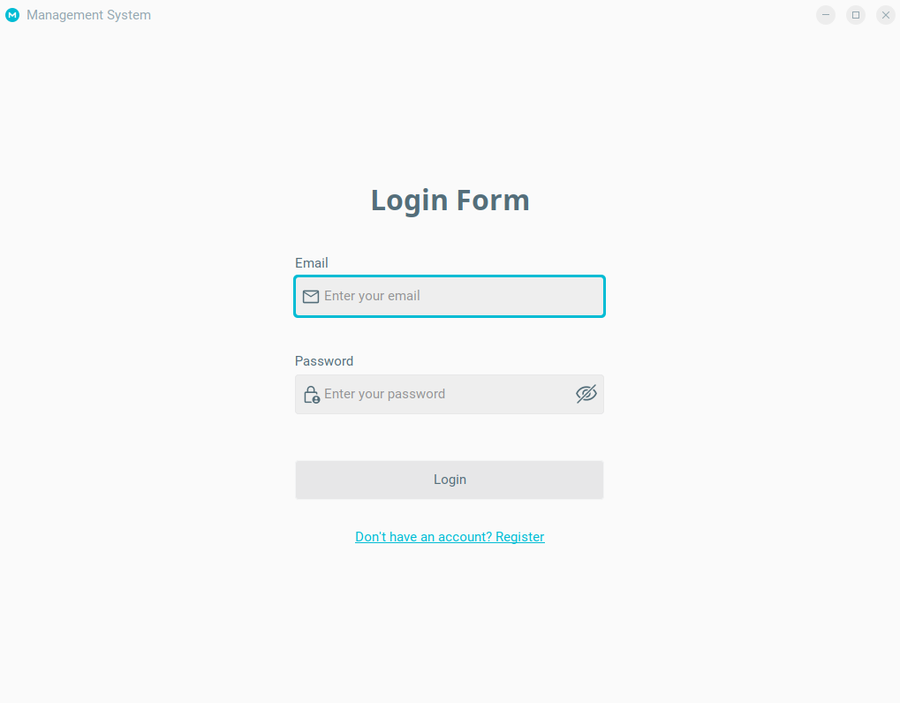
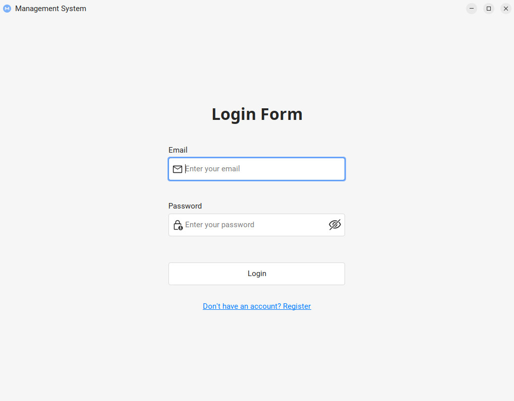
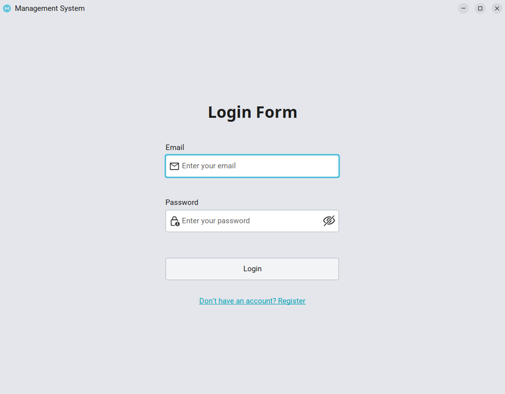
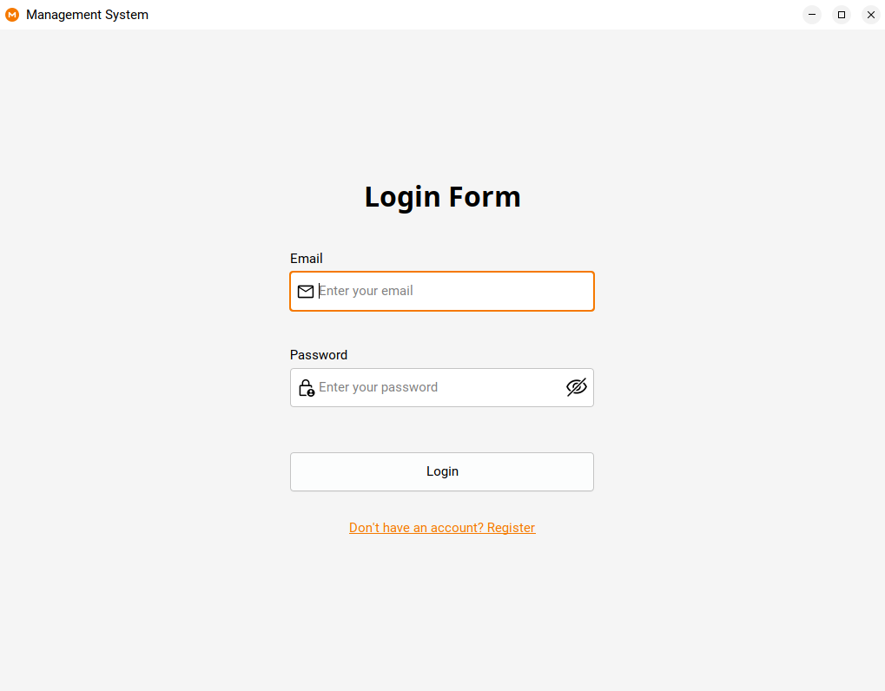

### Upgrade Maven wrapper guide (Optional)

**Add latest version instead `x.x.x`**

```bash
./mvnw -N wrapper:wrapper -Dmaven=x.x.x
```