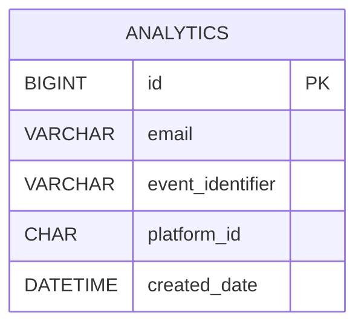

# Analytics microservice

## Description

A microservice responsible for tracking and storing user activity metrics collected from other services in the system. Examples: create a new image, convert image to different format, edit/crop image.

## Register consumer guide

Set up your environment variables:

- Set unique name for `youEventNameConsumer`
- `in` means that you want to consume messages from a topic
- `0` means that you want to set first group (you application could have multiple groups)
- `<your_topic_name>` replace with you topic name (it must be the same name as in you producer configuration)

```yaml
spring:
  kafka:
    stream:
      bindings:
        youEventNameConsumer-in-0:
          destination: <your_topic_name>
          content-type: application/json
```

Add configuration about trusted ObjectEvent and serializer:

- Set unique name for `applicationId`
- Set serializer for `valueSerde` (Should be the same as in the example)
- Add the package and the Class name of the object (This object should match exactly in the producer and consumer)

```yaml
spring:
  cloud:
    stream:
      kafka:
        streams:
          bindings:
            youEventNameConsumer-in-0:
              consumer:
                applicationId: management-system-analytics-event-name
                valueSerde: org.springframework.kafka.support.serializer.JsonSerde
                configuration:
                  spring.json.value.default.type: com.martinatanasov.management.system.analytics.events.YourObjectEvent
```

Use `youEventNameConsumer` inside `AnalyticsKafkaConsumers.java` to consume messages from the topic. The name of you method should match the name from the configuration!

## Database Schema

