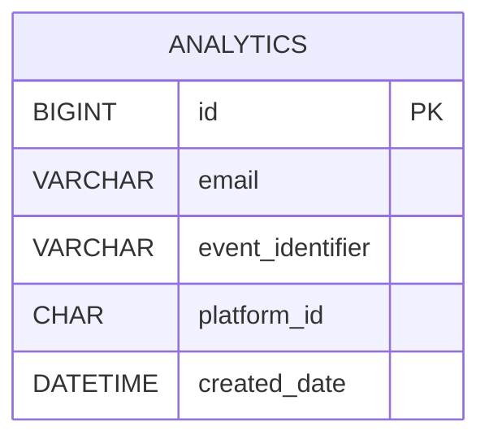

# Analytics microservice

## Description

A microservice responsible for tracking and storing user activity metrics collected from other services in the system. Examples: create a new image, convert image to different format, edit/crop image.

## Register consumer guide

Set up your environment variables:

- Set unique name for `youEventNameConsumer`
- `in` means that you want to consume messages from a topic
- `0` means that you want to set first group (you application could have multiple groups)
- `<your_topic_name>` replace with you topic name (it must be the same name as in you producer configuration)

```properties
spring.kafka.stream.bindings.youEventNameConsumer-in-0.destination=<your_topic_name>
spring.kafka.stream.bindings.youEventNameConsumer-in-0.content-type=application/json
```

Use `youEventNameConsumer` inside `AnalyticsKafkaConsumers.java` to consume messages from the topic.

## Database Schema

