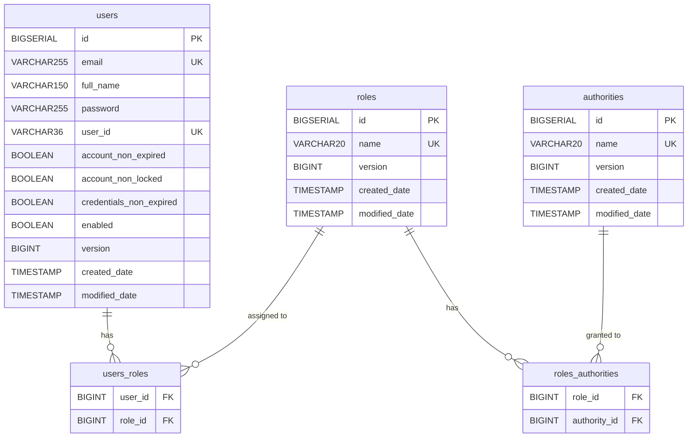

# Users microservice

## Description

The Users microservice is responsible for all functionalities related to users, as well as for generating a valid JWT token used to authenticate with the API Gateway.

## Set up the application:

**Generate Public and Private keys via keytool:**

1. Go to root directory and create `certs` directory:

    ```bash
    mkdir certs
    cd certs
    ```

2. Generate .p12 file via `keytool` in the `certs` directory
    ```bash
    keytool -genkeypair \
      -alias management-system-key \
      -keyalg RSA \
      -keysize 2048 \
      -validity 3650 \
      -storetype PKCS12 \
      -keystore management-system.p12 \
      -storepass <YOUR_STORE_PASSWORD> \
      -keypass <YOUR_KEY_PASSWORD> \
      -dname "CN=management-system, OU=Development, L=Sofia, C=BG"
    ```

3. Extract Public key as file
    ```bash
    keytool -exportcert \
      -alias management-system-key \
      -keystore management-system.p12 \
      -storetype PKCS12 \
      -rfc \
      -file public.pem
    ```

4. Extract Private key as file. It will require to enter the password!

    ```bash
    openssl pkcs12 \
      -in management-system.p12 \
      -nocerts \
      -nodes \
      -out private-key-pkcs12.pem
    ```

5. Convert `private-key-pkcs12.pem` to PKCS8 format

    ```bash
    openssl pkcs8 \
      -topk8 \
      -nocrypt \
      -in private-key-pkcs12.pem \
      -out private-key.pem
    ```

6. It is safe to delete `private-key-pkcs12.pem` that is no longer needed

### Check Redis connection (Optional)

Connect to redis cli via Docker container (`management-system-redis` is the name of the container)

```bash
docker exec -it management-system-redis redis-cli
```

Check all variables in Redis with following command: `KEYS "*"`

## Database schema



## Profiles

1. `locale`: This profiles recreates the tables every time in the H2 in memory database. (Default)
    -  Compatible initialization via (H2, PostgreSQL): [schema.sql](./src/main/resources/schema.sql) and [data.sql](./src/main/resources/data.sql)
2. `docker`: This profile uses a Docker container for the application and database. You need to create database one time before launching the application:
    -  Optimized script via (PostgreSQL): [schema-docker.sql](./src/main/resources/schema-docker.sql) and [data-docker.sql](./src/main/resources/data-docker.sql). It is very important uncomment `@JdbcTypeCode(SqlTypes.NAMED_ENUM)` inside Entity classes!

### Custom Messages

- `user-login` send via Kafka to analytics service
- `user-registered` send via Kafka to analytics service
